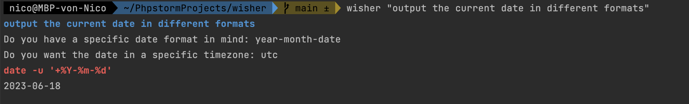
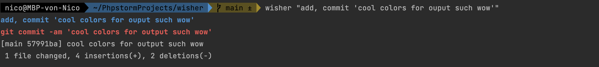
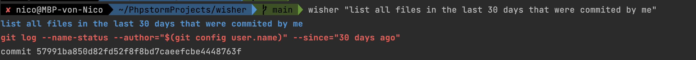
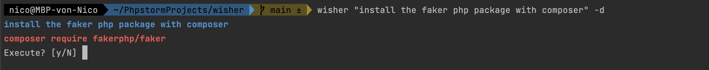
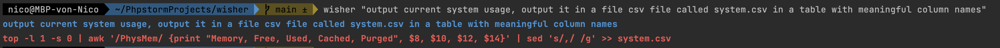

# Wisher - Your Command-Wishing Companion! 🌟

Wisher is a PHP CLI application that brings your wildest command fantasies to life! It harnesses the power of OpenAI's API to generate and execute shell commands based on your prompts, making your command-line dreams a reality! 🚀


## Examples of Command Wishes ✨

### Precise context for the Win!


### Commit Like a Boss!


### Git Adventures Await!


### Installing Magic in a Snap!


### Unleash System Superpowers!


## Prerequisites for a Magical Experience 🧙‍♀️

To embark on your Wisher journey, make sure you have the following enchantments in place:

- PHP version 8.1 or higher must be installed.
- Cast the spell `composer install` to conjure the project dependencies.

## How to Command Your Wishes ✨

To unlock the true power of Wisher, simply follow this sacred command:

```bash
bin/console wisher:wish <prompt> [--dry-run | -d]
```

Replace `<prompt>` with the mystical words of your desired command. Watch as Wisher weaves its magic and generates the shell commands you've always desired.

### Options to Unleash Extraordinary Control ✨

- `--dry-run` or `-d`: With this incantation, Wisher will seek your approval before executing the generated shell commands. No surprises!

If the prompt you provide is as mysterious as the dark abyss, fear not! Wisher will intuitively ask for more context to ensure the best possible results. 🧐

## TODO List - The Quest Continues! 🚀

- [ ] Forge a runnable PHAR file for effortless distribution and usage.
- [ ] Master the art of error handling to protect you from the forces of chaos.

Now, let your wishes soar and witness the extraordinary power of Wisher as it turns your prompts into reality! Enjoy the magical journey! 🌈✨