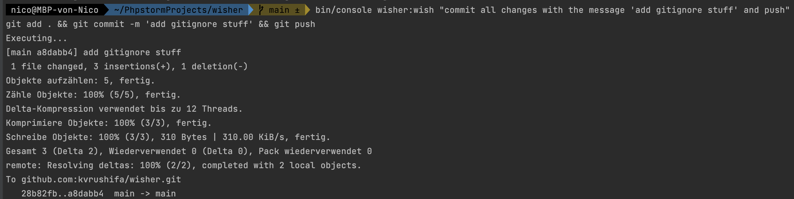

Apologies for the confusion. Here's the updated documentation:

# Wisher

Wisher is a PHP CLI application that uses OpenAI's API to generate and execute shell commands based on prompts.



## Prerequisites

- PHP version 8.1 or higher must be installed.
- Run `composer install` to install the project dependencies.

## Usage

To make a prompt and generate shell commands, use the following command:

```bash
bin/console wisher:wish <prompt> [--dry-run | -d]
```

Replace `<prompt>` with your desired prompt for generating the shell commands.

### Options

- `--dry-run` or `-d`: Asks for confirmation before executing the generated shell commands.

If the prompt is too vague, Wisher will automatically ask for more context to provide better results.

## TODO List

- [ ] Make a runnable PHAR file for easy distribution and usage.
- [ ] Error handling.